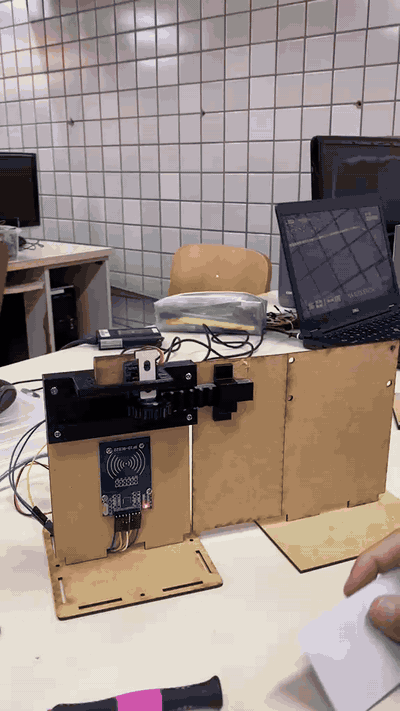
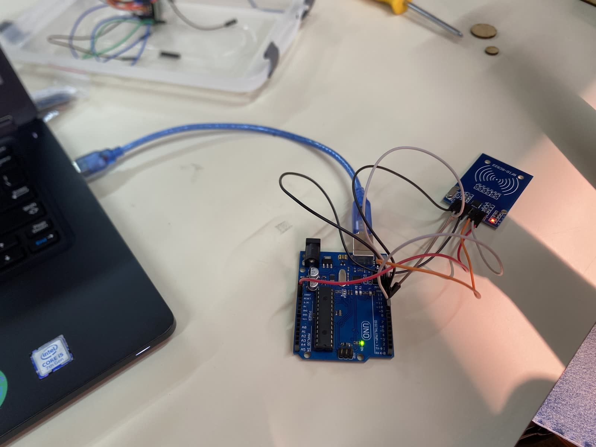
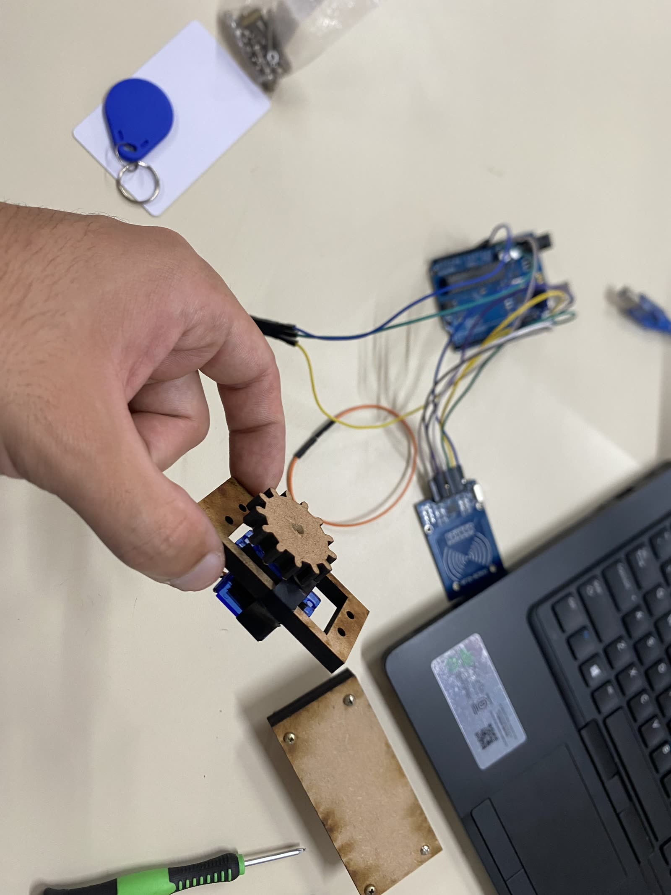
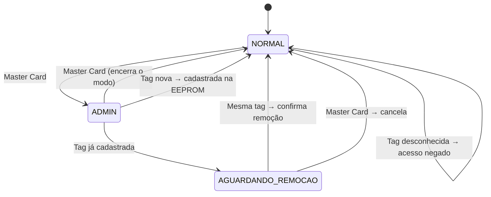
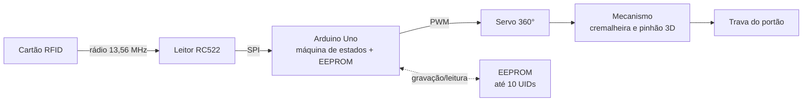

# ♿ Sistema Robótico de Destravamento com RFID — Acessibilidade UNICAP

<p align="center">
  
</p>

> **Uma porta que abre sem pedir ajuda.** Projeto acadêmico da disciplina de Robótica Inclusiva (UNICAP) que devolve autonomia a estudantes com mobilidade reduzida: basta aproximar o cartão e a trava destrava sozinha.


➡️ **[Documentação técnica completa (PDF)](docs/documentacao-tecnica.pdf)** • **[Peças para impressão 3D](hardware/stl/)** • **[Vídeo completo do protótipo](docs/img/demo.mp4)**

---

## 🎯 O problema

Na universidade, o acesso de estudantes cadeirantes às instalações depende de que **alguém abra manualmente a porta de acessibilidade**. Na prática, isso significa esperar, chamar terceiros e, muitas vezes, passar por situações constrangedoras para realizar algo tão simples quanto entrar em uma sala.

## 💡 A solução

Um **sistema de destravamento com RFID** controlado por Arduino: ao aproximar um cartão autorizado, um servo motor aciona uma trava impressa em 3D e a porta se abre — sem depender de ninguém. O cadastro de novos usuários é feito pelo próprio dispositivo, com um **Cartão Mestre**, e tudo fica salvo na memória do Arduino, **100% offline**.

| Sem o projeto 😕 | Com o projeto 😃 |
| :--- | :--- |
| Esperar um terceiro abrir a porta | Aproximar o cartão e entrar |
| Dependência e constrangimento | Autonomia e independência |
| Nenhum registro de acesso | Base pronta para logs futuros |

---

## 🎬 Demonstração

> ⚡ O GIF do topo é gerado do vídeo real do protótipo — [assista ao vídeo completo, com áudio](docs/img/demo.mp4).

### 🛠️ Jornada de desenvolvimento

O projeto evoluiu por marcos claros — dos primeiros testes de leitura ao mecanismo funcional:

| 1️⃣ Primeiros testes do RFID | 2️⃣ Montagem mecânica v1 (MDF) |
| :---: | :---: |
|  |  |
| *Primeiro contato e leituras com o módulo RC522* | *Estrutura em MDF cortado a laser — substituída por peças impressas em 3D (ver [Desafios](#-desafios-e-soluções))* |

---

## ⚙️ Funcionalidades

- **🔓 Controle de acesso físico:** destravamento automatizado via leitura de tags RFID (13,56 MHz).
- **🔀 Acionamento em alternância (toggle):** a mesma leitura abre ou fecha a porta.
- **🗝️ Gestão via Master Card:** cadastro e remoção de usuários direto no dispositivo, sem plugar o Arduino no computador.
- **💾 Armazenamento não-volátil:** UIDs salvos na EEPROM nativa (até 10 cartões no código atual, expansível) — sobrevive a quedas de energia.
- **📴 100% offline:** sem internet, sem servidor, sem nuvem.

---

## 🧠 Arquitetura

O firmware é uma **máquina de estados** com três modos de operação, o que permite administrar usuários pelo próprio leitor:



### Fluxo de sinais do sistema



---

## 🛠️ Hardware

### Lista de componentes (BOM)

| Componente | Especificação | Qtd. | Custo estimado* |
| :--- | :--- | :---: | :--- |
| Arduino Uno | R3 (ou compatível) | 1 | R$ 60–120 |
| Leitor RFID | RC522, 13,56 MHz | 1 | R$ 10–20 |
| Servo motor | SG90 modificado p/ rotação contínua (360°) | 1 | R$ 15–30 |
| Cartões/tags RFID | Kit com cartões e chaveiros | 1 kit | R$ 10–15 |
| Protoboard + jumpers | — | 1 kit | R$ 20–40 |
| Mecânica | MDF cortado a laser + peças impressas em 3D | 1 | R$ 30–60 |
| **Total** | | | **≈ R$ 150–300** |

> \* Valores aproximados em reais, com componentes nacionais/genéricos.

### 🔌 Esquema de ligação (pinagem)

| Componente | Pino do componente | Pino do Arduino |
| :--- | :--- | :--- |
| RFID RC522 | SDA (SS) | Digital 10 |
| RFID RC522 | SCK | Digital 13 |
| RFID RC522 | MOSI | Digital 11 |
| RFID RC522 | MISO | Digital 12 |
| RFID RC522 | IRQ | *Não conectado* |
| RFID RC522 | RST | Digital 9 |
| RFID RC522 | GND | GND |
| RFID RC522 | **3.3V** | 3.3V |
| Servo motor | Sinal (laranja/amarelo) | Digital 7 |
| Servo motor | VCC (vermelho) | 5V *(recomendado fonte externa)* |
| Servo motor | GND (marrom/preto) | GND |

> ⚠️ **Atenção:** o RC522 **não tolera 5V** no pino de alimentação — conecte-o **exclusivamente ao 3.3V**, sob risco de queimar o módulo.

---

## 🖨️ Mecânica

A trava é um mecanismo de **cremalheira e pinhão** impresso em 3D, acoplado ao servo de rotação contínua; a estrutura do portão é cortada a laser em MDF.

As **quatro peças** do mecanismo estão prontas para reimpressão em [`hardware/stl/`](hardware/stl/):

| Peça | Arquivo | Função |
| :--- | :--- | :--- |
| Pinhão (engrenagem) | [`gear.stl`](hardware/stl/gear.stl) | Acoplado ao servo, converte rotação em movimento linear |
| Cremalheira | [`gear_rack.stl`](hardware/stl/gear_rack.stl) | Trava linear acionada pelo pinhão |
| Suporte do motor | [`motor_holder.stl`](hardware/stl/motor_holder.stl) | Fixa o servo à estrutura |
| Suporte da cremalheira | [`rack_holder.stl`](hardware/stl/rack_holder.stl) | Guiamento e fixação da cremalheira |

- **Parâmetros de impressão:** material, infill e suportes documentados em [`hardware/stl/README.md`](hardware/stl/README.md)

---

## 🚀 Como instalar e usar

### 1. Dependências

Instale as bibliotecas no IDE do Arduino (Sketch → Incluir Biblioteca → Gerenciar Bibliotecas):

- [`MFRC522`](https://github.com/miguelbalboa/rfid) (GithubCommunity)
- `Servo` (nativa)
- `EEPROM` (nativa)
- `SPI` (nativa)

### 2. Configure o Cartão Mestre

Abra `firmware/destravamento_rfid/destravamento_rfid.ino` e informe o UID do cartão administrador na variável `masterID`:

```cpp
String masterID = "63:13:ED:1B";
```

> 💡 Para descobrir o UID de um cartão, rode um sketch de leitura RFID (ou o próprio firmware) e veja o UID no Monitor Serial (9600 baud).

### 3. Faça o upload

Conecte o Arduino Uno via USB, selecione a placa e a porta corretas e clique em **Upload**. Abra o **Monitor Serial (9600)** para acompanhar tudo em tempo real.

### 4. Modo de operação

**No dia a dia (Modo NORMAL):**
| Ação | Resultado |
| :--- | :--- |
| Aproximar cartão **cadastrado** | Porta destrava/trava (alternância) |
| Aproximar cartão **desconhecido** | Acesso negado |

**Administrando usuários:**
1. 🗝️ Aproxime o **Master Card** → o sistema entra em **MODO ADMIN**.
2. ➕ Aproxime uma **tag nova** → ela é cadastrada e salva na EEPROM, e o sistema volta ao modo normal.
3. ➖ Aproxime uma **tag já cadastrada** (em modo admin) → o sistema pede confirmação: aproxime **a mesma tag novamente** para removê-la, ou o **Master Card** para cancelar.
4. 🗝️ Aproxime o **Master Card** de novo → encerra o modo admin.

Tudo é confirmado no Monitor Serial — nenhuma ferramenta além do leitor é necessária.

---

## 🧗 Desafios e soluções

| Desafio | Como resolvemos |
| :--- | :--- |
| A estrutura em MDF cortado a laser não funcionou como esperado | Redesenho completo do mecanismo para **impressão 3D** (cremalheira, pinhão e suportes), com tolerâncias e resistência adequadas — [peças disponíveis no repo](hardware/stl/) |
| O RC522 queima com 5V | Alimentação dedicada ao 3.3V do Arduino e aviso documentado na pinagem |
| Servo de rotação contínua não tem posição fixa | Calibração do neutro em 90° e pulsos de 80°/100° com temporização de 1 s para abrir/fechar de forma controlada |
| Cadastro não poderia depender de computador | Máquina de estados administrativa acionada pelo próprio Master Card, com confirmação em duas leituras para remoção |
| Cadastros não podiam se perder ao desligar | Persistência dos UIDs na EEPROM: contador no endereço 0 + IDs em blocos de 12 bytes |

---

## 🗺️ Roadmap

Ideias para próximas versões — contribuições são bem-vindas:

- [ ] Feedback sonoro e visual (buzzer + LED verde/vermelho)
- [ ] Display OLED com status do sistema
- [ ] ESP32 + registro de acessos com data/hora (RTC)
- [ ] Interface web para gestão de cartões
- [ ] Alimentação por bateria/power bank
- [ ] Aumento da capacidade de cartões (EEPROM externa ou I²C)

---

## 👥 Equipe

| Nome | GitHub | LinkedIn |
| :--- | :--- | :--- |
| Heitor Farias Santos | [@heitorfariass](https://github.com/heitorfariass) | www.linkedin.com/in/heitorfariassantos/ |
| João da Fonte | [@joaodafontequeiroz](https://github.com/joaodafontequeiroz) | www.linkedin.com/in/joao-da-fonte-queiroz-280822363 |
| Nina Lira | [@ninalira](https://github.com/ninalira) | /www.linkedin.com/in/nina-lira-b29961325/ |
| Marcelo Caldas | — | www.linkedin.com/in/marcelo-caldas-de-ara%C3%BAjo-filho-4aa669394/ |

## 🙏 Agradecimentos

À disciplina de **Robótica Inclusiva** da [UNICAP — Universidade Católica de Pernambuco](https://www.unicap.br/) e aos professores *Wilmer Cordoba e Emmanuel Barreto*, pela orientação e pelo incentivo a projetos com impacto social real.

---

## 📄 Licença

Este projeto está sob a licença [MIT](LICENSE) — sinta-se livre para estudar, reproduzir e adaptar.

<p align="right"><sub>Feito com 💜 por estudantes que acreditam que tecnologia boa é tecnologia que inclui.</sub></p>
